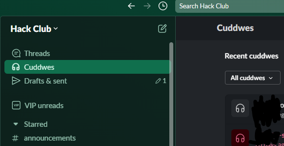

# SlackCuddles
Why huddle when you can cuddle? This simple slack mod makes huddling fun.
> # **Usage:**
>
> In tampermonkey or your favorite userscript manger, open a new script and paste in `cuddles.js`
> 
> Also available at [https://greasyfork.org/en/scripts/524439-slack-cuddles](https://greasyfork.org/en/scripts/524439-slack-cuddles) though this may not always be the latest version.

License: GNU General Public License v3.0 or later; http://www.gnu.org/copyleft/gpl.html
